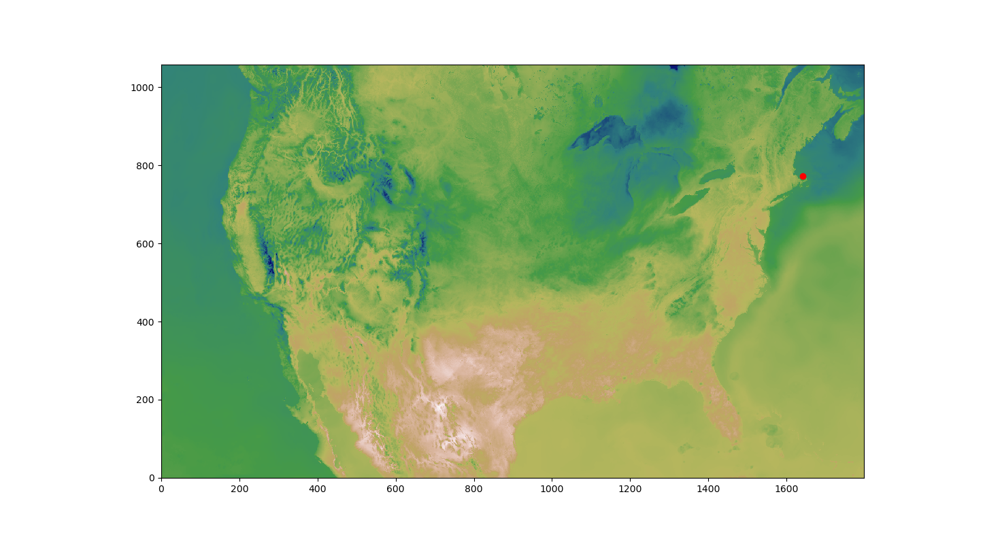

# Bitstory's HRRR 
A CLI to collect weather forecats from NWS's HRRR model. This model provides hourly forecasts for the continential US with high resolution. Forecasts can be collected based upon lat/lon coordinates.


The image below is an example of the array of temperature values from the HRRR model with a test location centered on Cape Cod, MA.


# Usage:
## Install the dependencies
```
$ python3 -m venv hrrr_env
$ pip install -r requirements.txt
(base) bitstory/hrrr $ source hrrr_env/bin/activate
(hrrr_env) (base) bitstory/hrrr $
```

## Get the hrrr data for a specific timeframe
```
(hrrr_env) (base) bitstory/hrrr $ python hrrr.py --start 2023-06-28 --end 2023-06-30

```  

# Create the master dataframe
```
(hrrr_env) (base) bitstory/hrrr $ python hrrr.py --make-master

```

# Environment Install
```
$ python -m venv hrrr_env
$ source hrrr_env/bin/activate
$ pip install --upgrade pip
$ pip install pygrib
$ pip install pandas
$ pip install boto3
$ python hrrr.py -h
$ pip freeze > hrrr_requirements.txt
```

# USAGE:
```
(base) /Users/gunnarpope $ sfa
(base) bitstory/bitstory $ cd hrrr
(base) bitstory/hrrr $ conda activate sfa_env
(sfa_env) bitstory/hrrr $ python hrrr.py --start 2023-04-01 --end 2023-04-30
```

## Data Rates
* It takes about 30 seconds for each forecast to be downloaded and processed
* That is 12 minutes for 24 hour of forecasts
* That translates to roughly 100 hours for 1.5 years of forecast data.
  * 109.5 = (12*365*1.5)/60

# Install pygrib with conda

[instructions](https://jswhit.github.io/pygrib/installing.html)
```
(base) bitstory/hrrr $ conda deactivate
(base) bitstory/hrrr $ conda activate sfa_env
 (sfa_env) (base) bitstory/hrrr $ python hrrr.py
[[  3.5625   3.5625   0.75   ... -10.     -10.     -10.    ]
 [  3.5625   8.125    4.625  ... -10.     -10.     -10.    ]
 [  1.8125   5.9375   1.375  ... -10.     -10.     -10.    ]
 ...
 [-10.     -10.     -10.     ... -10.     -10.     -10.    ]
 [-10.     -10.     -10.     ... -10.     -10.     -10.    ]
 [-10.     -10.     -10.     ... -10.     -10.     -10.    ]]
 ```

 # get the data by lat and long
 ```
$ grib_ls -j -l 43.7,-72.3,1 hrrr.t00z.wrfsubhf01.grib2 > hrrr.hanover.json
 ```

Find the 4 closest points to Hanover, NH
```
$ grib_ls -j -l 43.7,-72.3,4  hrrr.t00z.wrfsubhf01.grib2
```

# Datarates
219706637 Jun  5 19:56 hrrr.t00z.wrfsubhf01.grib2
So roughly, each file is 200MB for each 36 hour prediction
And I have 300GB (say 100GB usable), then available on disk, so I can handle 5000 records.
This data needs to be compressed!

# Flux Parameters
Beam radiation is direct radiation, e.g. photons that have not been scattered. Diffuse radiation is indirect and has been scattered. Examples of beam radiation from the sky would be from the sun directly to your eye. Diffuse solar radiation would be the blue sky (scattered out of the direct beam by the atmosphere), clouds and anything you can see that is illuminated by the sun.

Shortwave radiation refers to radiation of solar origin, which is primarily in the visible and shorter wavelengths. Longwave refers to radiation of terrestrial origin, which is typically in the infrared and longer wavelengths (dependent on temperature) and is radiated by the earth, us, clouds, the atmosphere, etc.

A flux is the "rate of flow of a property per unit area" and for radiation is generally expressed in watts per square meter, Wm−2. A watt is 1 Joule per second, so this is an energy flux, a or the mount of energy flowing through a 1 m2 surface every second.

To apply this to your variables:

## Visible beam downward solar flux

This is the direct radiation in the visible spectrum from the sun expressed as a flow of energy. This is generally given either at the top of atmosphere or at the surface. For ToA, this would be the rate of energy through a 1 square meter patch just above the atmosphere. For the surface, this would be the rate of energy into a 1 square meter area on the earths surface.

## Visible diffuse downward solar flux

This is a measure of radiation in the visible spectrum that isn't directly from the sun. At the surface of the earth this flux would be the rate of energy flowing into a 1 square meter patch of earth from reflection of sunlight (scattering) and from the rest of the sky and clouds that isn't the direct path from the sun.

## Upward longwave radiation flux

This is the rate of energy flow from the sum of all terrestrial emission. At the top of the atmosphere this would be the terrestrial energy escaping to space (per square meter).

## Near IR beam downward solar flux

This is the same as the visible beam downward solar flux except it is in the near IR band (infrared wavelengths longer but close to that of visible red) rather than in the visible spectrum.

## Downward longwave radiation flux

This flux is terrestrial emission sources that send energy downward toward the earth. This energy would come from clouds, the atmosphere (greenhouse gasses), etc.

## Downward solar radiation flux

This is the total shortwave flux (visible + IR + UV, etc; beam and diffuse) downward through the top of atmosphere or at the surface.
